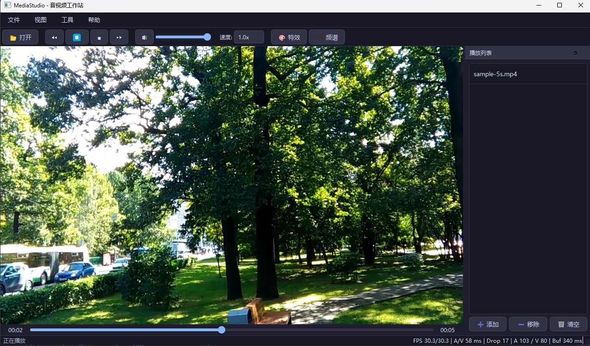
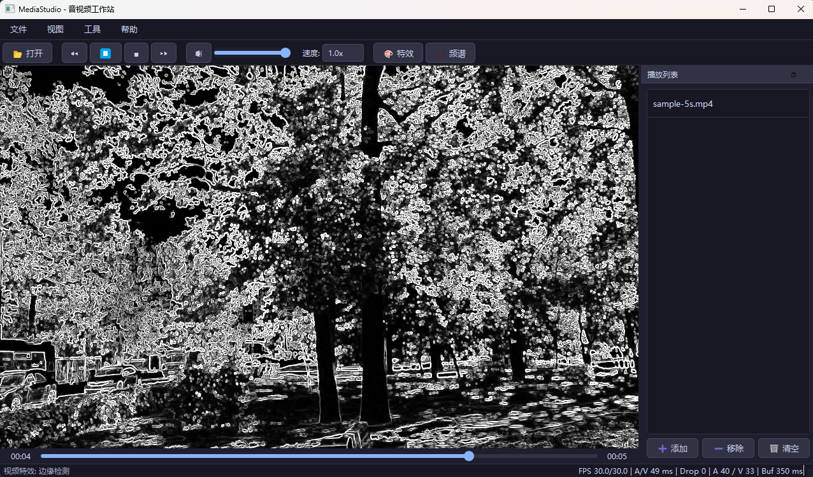
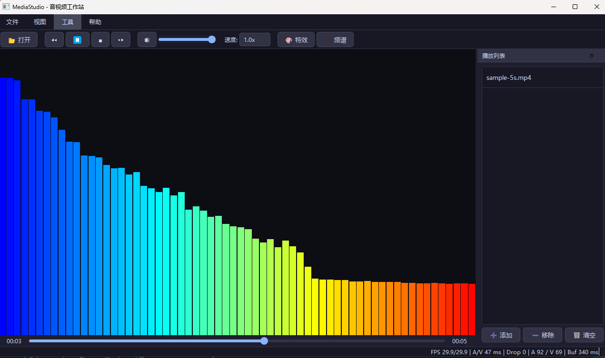

# MediaStudio

MediaStudio 是一个基于 `C++17`、`Qt 6`、`FFmpeg`、`OpenGL` 和 `WASAPI` 实现的 Windows 桌面音视频播放器。这个项目以“先做出一个真正可用的传统播放器，再逐步进入 AI 音视频方向”为目标，当前已经完成 V1 阶段的主体功能。



## 项目特点

- 支持常见音视频文件播放、暂停、停止、进度跳转、音量调节和倍速播放
- 基于 FFmpeg 完成解封装、音视频解码、重采样和格式转换
- 基于 WASAPI 输出音频，并以音频主时钟驱动视频同步
- 采用 `demux + audio worker + video worker` 三线程播放架构
- 支持 OpenGL 视频特效，包括灰度、反色、边缘检测、模糊、亮度/对比度和怀旧色调
- 支持音频 FFT 频谱可视化
- 状态栏提供实际渲染 FPS、解码 FPS、A/V diff、丢帧数、队列和缓冲状态
- 提供可选媒体库能力，支持数据库记录、收藏和播放历史

## 效果展示

### 视频特效



### 音频频谱



## 技术架构

```text
MainWindow
  |
  v
PlayerController
  |-- demux/control thread
  |-- audio worker ----> AudioOutput (WASAPI)
  |-- video worker ----> VideoWidget ----> VideoRenderer (OpenGL)
  |
  v
MediaDecoder (FFmpeg)
```

播放主链路：

1. `MediaDecoder` 负责读取压缩包并完成音视频解码
2. `PlayerController` 将音频包和视频包分发到独立队列
3. 音频线程输出 PCM，并维护播放器主时钟
4. 视频线程根据音频时钟等待、显示或丢弃视频帧
5. `VideoRenderer` 在 GPU 侧完成纹理上传、YUV 转 RGB 和特效渲染

## 当前功能

| 模块 | 能力 |
| --- | --- |
| 播放控制 | 打开文件、播放/暂停、停止、快进/快退、拖动 seek、音量、静音、倍速 |
| 视频渲染 | OpenGL 渲染、YUV420P 纹理路径、7 种视频特效 |
| 音频处理 | WASAPI 输出、重采样、变速、音频主时钟、FFT 频谱 |
| 播放稳定性 | 三线程解码、generation 机制、seek 后队列清理、同步丢帧 |
| 调试信息 | 渲染 FPS、解码 FPS、A/V diff、累计丢帧、音视频队列、音频缓冲 |
| 扩展能力 | 可选数据库媒体库、FFmpeg 转码工具 |

## 目录结构

```text
MediaStudio/
|-- src/                 核心源码
|-- docs/                使用文档、学习笔记、阶段总结
|-- sql/                 数据库初始化脚本
|-- tools/               本地构建与运行脚本
|-- third_party/         第三方依赖说明
|-- assets/screenshots/  README 截图
|-- CMakeLists.txt
|-- CMakePresets.json
`-- README.md
```

## 构建环境

当前项目主要面向 Windows：

- Windows 10 / 11 x64
- CMake `>= 3.24`
- Ninja
- Qt 6
- FFmpeg 开发库
- GLEW
- 可选：MariaDB Connector/C，用于数据库功能

仓库中不包含大型第三方 SDK。你需要在本机准备依赖，并通过 CMake 参数或本地 `CMakeUserPresets.json` 指定路径。

## 快速开始

先准备本机依赖路径，然后在项目根目录执行：

```powershell
cmake --preset mingw-release `
  -DMEDIASTUDIO_QT_ROOT=<path-to-qt> `
  -DMEDIASTUDIO_FFMPEG_ROOT=<path-to-ffmpeg> `
  -DMEDIASTUDIO_GLEW_ROOT=<path-to-glew>

cmake --build --preset mingw-release
```

默认情况下，数据库功能关闭：

```text
MEDIASTUDIO_ENABLE_MYSQL=OFF
```

如果需要启用媒体库功能，再额外提供兼容当前工具链的数据库依赖：

```powershell
cmake --preset mingw-release `
  -DMEDIASTUDIO_ENABLE_MYSQL=ON `
  -DMEDIASTUDIO_MYSQL_CONNECTOR_ROOT=<path-to-mariadb-connector>
```

更完整的环境准备、运行方式和快捷键说明见 [docs/USAGE.md](docs/USAGE.md)。

## 文档索引

- [使用文档](docs/USAGE.md)：环境准备、编译、运行、功能说明和常见问题
- [学习文档](docs/LEARNING.md)：模块拆解、线程模型、阅读顺序和关键概念
- [阶段总结](docs/SUMMARY.md)：项目演进、问题修复记录和后续规划

## 项目状态

当前版本可以视为 `V1` 稳定版：

- 基础播放器功能完整
- seek、倍速、音视频同步和纯视频流播放已完成一轮稳定性修复
- OpenGL 渲染路径已升级到 YUV420P GPU 转换
- 代码结构已整理为适合继续迭代和公开展示的状态

后续会继续围绕更完整的测试覆盖、性能优化和 AI 音视频能力扩展推进。
